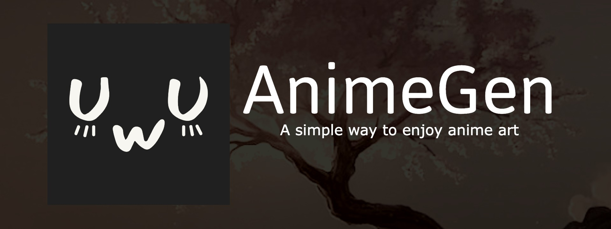

<div align="center">

[](https://github.com/cranci1/AnimeGen/actions/workflows/build.yml) 
[](https://img.shields.io/badge/Platform-iOS%20%7C%20iPadOS%2013.0%2B-red?logo=apple&logoColor=white)
[](https://custom-icon-badges.demolab.com/github/last-commit/cranci1/AnimeGen) 
[](https://custom-icon-badges.demolab.com/github/v/release/cranci1/AnimeGen)
[](https://testflight.apple.com/join/Qx5saHll)

</div>

# AnimeGen
AnimeGen, a mobile app developed in Swift that allows users to **save**, **generate**, and **share** anime images! Using public APIs to fetch the images. GPLv3 Licensed.

```
Copyright © 2023-2024 cranci. All rights reserved.

AnimeGen is free software: you can redistribute it and/or modify
it under the terms of the GNU General Public License as published by
the Free Software Foundation, either version 3 of the License, or
(at your option) any later version.

AnimeGen is distributed in the hope that it will be useful,
but WITHOUT ANY WARRANTY; without even the implied warranty of
MERCHANTABILITY or FITNESS FOR A PARTICULAR PURPOSE. See the
GNU General Public License for more details.

You should have received a copy of the GNU General Public License
along with AnimeGen. If not, see <https://www.gnu.org/licenses/>.
```

## Index

- [Compatibility](#compatibility)
- [Screenshots](#screenshots)
- [Download](#download)
- [APIs](#apis)
  - [Working APIs](#working-apis)
- [Third Party Software](#third-party-software)
- [Acknowledgements](#acknowledgements)
- [Build](#build)

## Compatibility

AnimeGen is designed to work smoothly on any device running iOS or iPadOS 13.

> Please note that while AnimeGen should function on all compatible devices, the user experience may vary depending on the specific device model and its performance capabilities.

## Screenshots

<div align="center">
<table>
  <tbody>
  <tr>
    <td></td>
    <td></td>
    <td></td>
  </tr>
  </tbody>
</table>
</div>

## Download

You can download the IPA file for installation via TrollStore, AltStore, or Sideloadly. Alternatively, you can install the app via TestFlight. Please note that the nightly-IPA may be unstable. *The Testflight beta build is recommended*.

- [Testflight beta](https://testflight.apple.com/join/Qx5saHll)
- [Download stable-IPA](https://github.com/cranci1/AnimeGen/releases/download/v1.9/AnimeGen.ipa)
- [Download nightly-IPA](https://nightly.link/cranci1/AnimeGen/workflows/build/main/AnimeGen-IPA.zip)

## APIs

Thanks to all the Developer that are providing this apis for public use! By cliccking the name of each API, you will be able to see the API website.
Without them this project wouldn't exist, so thanks very much to all of them!

### Working APIs

| APIs                                                       | Type     | Format  | Status |
| ---------------------------------------------------------- | -------- | ------- | :----: |
| [pic.re](https://doc.pic.re/)                              | SFW      | IMG     |   ✅   |
| [waifu.im](https://docs.waifu.im/)                         | SFW/NSFW | IMG     |   ✅   |
| [waifu.pics](https://waifu.pics/docs)                      | SFW/NSFW | IMG/GIF |   ✅   |
| [Waifu.it](https://waifu.it/)                              | SFW/NSFW | IMG/GIF |   ⚠️    |
| [Hmtai](https://hmtai.hatsunia.cfd/endpoints)              | SFW/NSFW | IMG/GIF |   ⚠️    |
| [nekos.best](https://docs.nekos.best/)                     | SFW      | IMG     |   ✅   |
| [Nekos api](https://nekosapi.com/docs)                     | SFW/NSFW | IMG     |   ✅   |
| [Nekos.moe](https://docs.nekos.moe)                        | SFW/NSFW | IMG     |   ✅   |
| [NekoBot](https://nekobot.xyz/)                            | SFW/NSFW | IMG/GIF |   ✅   |
| [Kyoko](https://api.rei.my.id/docs/ANIME/WAIFU-Generator/) | SFW/NSFW | IMG/GIF |   :x:  |
| [Purr Bot](https://purrbot.site/)                          | SFW/NSFW | IMG/GIF |   ✅   |
| [n-sfw api](https://n-sfw.com/)                            | SFW/NSFW | IMG/GIF |   ✅   |
| [nekos.life](https://nekos.life)                           | SFW/NSFW | IMG/GIF |   ✅   |

> [!Note]
> The Hmtai api is not fully supported, [why?](https://github.com/cranci1/AnimeGen/blob/main/Privacy/Hmtai.md)

## Third Party Software

- [SDWebImage](https://github.com/SDWebImage/SDWebImage): This software is used to handle .gif images for the gallery in the app. Under the [MIT License](https://github.com/SDWebImage/SDWebImage/blob/master/LICENSE)

## Acknowledgements

- [NineAnimator](https://github.com/SuperMarcus/NineAnimator): Inspired the launch screen idea and provided a base for the app launch screen.
- [Nekidev](https://github.com/Nekidev/anime-api): Provided the anime-api list that helped me find more api to use.

## Build

If you want to build the app yourself, follow these steps:

1. Ensure you have Xcode installed on your machine.

2. Clone the repo:

```
git clone https://github.com/cranci1/AnimeGen
```

3. Navigate to the directory:

```bash
cd AnimeGen
```

3-1. Update the `Secrets.swift` file with your specific values: the Discord Bot Token, a Discord webhook, and your Discord channel ID:

```swift
import Foundation

struct Secrets {
    static var apiToken = "Bot DiscordBotTokenHere"
    static var discordWebhookURL = URL(string: "YourWebhookUrl")!
    static var discordChannelId = "YourChannelIdHere"
    static var waifuItToken = "waifu.it token"
}

```
> Note: This can also be modified directly from the app in the developer section!

4. Run the script:

```
chmod +x ./ipabuild.sh & ./ipabuild.sh
```

If the build was successful, you should see a "build" folder with a subfolder "DerivedDataApp" and the AnimeGen.ipa file in the AnimeGen/build directory. You can now use any IPA installer like TrollStore, AlStore, Scarlet, ESign or sideloadly to install the IPA on the desired device.

> Note: If you encounter any issues during the build, please create an issue I will try my best to help!
