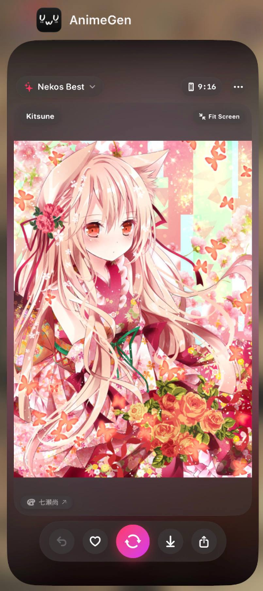
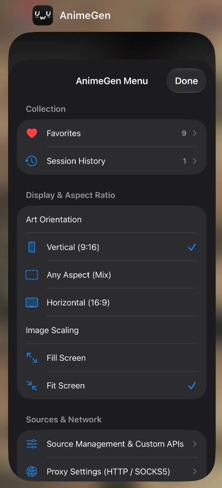
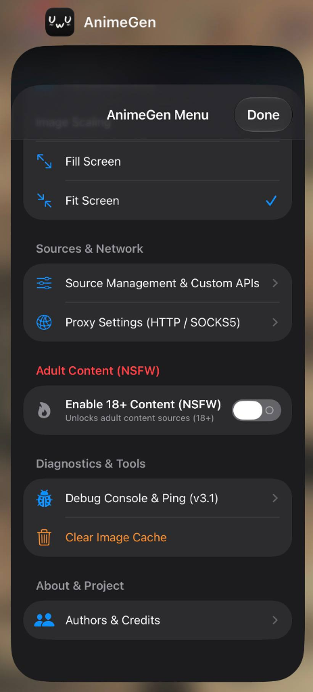

<div align="center">

[](https://github.com/cranci1/AnimeGen/actions/workflows/build.yml)
[](https://img.shields.io/badge/Platform-iOS%20%7C%20iPadOS%2016.0%2B-red?logo=apple&logoColor=white)
[](https://www.gnu.org/licenses/gpl-3.0)
[](https://swift.org)

</div>

# AnimeGen (v3.1)

**AnimeGen** is a modern, fast, and feature-packed iOS & iPadOS application to discover, generate, view, and save high-resolution anime art and animated GIFs from public and custom APIs.

---

## ✨ Features (v3.1)

- 🎨 **Modern Liquid Glass UI**: Clean SwiftUI interface with dynamic ambient background glow, interactive gestures (swipe navigation, pinch-to-zoom up to 4x, double-tap to favorite).
- 🎬 **Hardware-Accelerated GIF Support**: Smooth 60 FPS playback for animated reaction GIFs and clips via Kingfisher.
- 📐 **Aspect Ratio & Scale Modes**:
  - Filter images by orientation: **Vertical (9:16)**, **Horizontal (16:9)**, or **Any (Mix)**.
  - Seamless toggle between **Fill Screen** (immersive wallpaper look) and **Fit Screen** (full uncropped illustration).
- 🔌 **Custom API Engine**: Easily connect any custom REST / JSON image API by providing an endpoint URL and JSON key path (`url`, `file_url`, `message`, `link`, etc.).
- 🌐 **Built-in Proxy Support**:
  - Full support for **HTTP, HTTPS, and SOCKS5** proxies.
  - Optional username & password authentication.
  - Live connection diagnostic tool (measures ping latency and resolves external IP).
- 🔞 **Optional 18+ (NSFW) Content Mode**:
  - Securely hidden by default with an age verification prompt (18+).
  - Unlocks Danbooru R-18, NekoBot Hentai, and PurrBot Adult GIFs.
- ❤️ **Favorites & Session History**: Save favorite artworks persistently to local storage and browse through your current session history with a grid gallery.
- 💾 **Photos & GIF Export**: Save high-res images and animated GIF files directly to your iOS Photos library or share via the native iOS Share Sheet.
- 🐞 **Debug Console & Diagnostics**: Built-in terminal with live API health checks (ping tests) and one-tap anonymous log sharing via Pastebin.

---

## 📸 Screenshots

<div align="center">

| Modern HD Canvas | Collection & Display | Sources, NSFW & Credits |
| :---: | :---: | :---: |
|  |  |  |

</div>

---

## 📥 Download & Installation

You can install the compiled `.ipa` using **TrollStore**, **AltStore**, **SideStore**, **LiveContainer**, **Feather**, **Scarlet**, **ESign**, or **Sideloadly**.

- Download the latest IPA build from the [GitHub Actions Artifacts](https://github.com/cranci1/AnimeGen/actions) or Releases tab.

---

## 📡 Supported APIs & Sources

Special thanks to all the developers and communities providing these public APIs:

### SFW (Safe for Work) Sources
| API / Source | Content Format | Status | Description |
| :--- | :---: | :---: | :--- |
| [nekos.best](https://nekos.best) | Image & Animated GIF | ✅ Active | High-quality artworks & reaction clips with orientation filtering |
| [pic.re](https://doc.pic.re/) | HD Illustration | ✅ Active | Ultra-high-resolution anime illustrations |
| [waifu.pics](https://waifu.pics) | Animated GIF | ✅ Active | Reaction GIFs and anime animations |
| [nekobot.xyz](https://nekobot.xyz/) | Image | ✅ Active | Kemonomimi, anime characters & art |
| [nekosapi.com](https://nekosapi.com/) | HD Image | ✅ Active | Character database & rich artwork |
| [nekos.life](https://waifu.life) | Image & GIF | ✅ Active | Classic anime gallery & expressions |
| [nekos.moe](https://nekos.moe/) | Image | ✅ Active | Community curated anime illustrations |
| [purrbot.site](https://purrbot.site) | Animated GIF | ✅ Active | SFW anime reaction clips & gifs |
| [danbooru.donmai.us](https://danbooru.donmai.us) | Image / GIF | ✅ Active | Popular booru image database |
| [waifu.im](https://docs.waifu.im/) | Image | ⚠️ Maintenance | Cloudflare upstream protection active |

### 🔞 18+ (NSFW) Sources *(Unlocked via Age Verification)*
| Source | Content Format | Status | Description |
| :--- | :---: | :---: | :--- |
| **NekoBot (Hentai)** | HD Image | ✅ Active | Adult anime artworks & illustrations |
| **NekoBot (NSFW GIF)** | Animated GIF | ✅ Active | 18+ animated GIF animations |
| **PurrBot (Adult GIF)** | Animated GIF | ✅ Active | 18+ reaction clips & anime GIFs |
| **Danbooru (R-18)** | Image & GIF | ✅ Active | Explicit R-18 tagged anime artwork |

### 🔌 Custom Sources
| Source | Content Format | Status | Description |
| :--- | :---: | :---: | :--- |
| **Custom JSON API** | Any Image / GIF | 🌟 Custom | Connect any REST API returning JSON with image URLs |

---

## 🛠️ Building from Source

1. Ensure you have **macOS** with **Xcode 14.0+** installed.
2. Clone the repository:
   ```bash
   git clone https://github.com/cranci1/AnimeGen.git
   cd AnimeGen
   ```
3. Build the project using Xcode or the automated shell script:
   ```bash
   chmod +x ./ipabuild.sh
   ./ipabuild.sh
   ```
   The compiled `.ipa` will be located inside the `AnimeGen/build` directory.

---

## 👥 Authors & Credits

- **[cranci](https://github.com/cranci1)** — Original creator and project maintainer (v1.0 – v3.0).
- **[l1ratch](https://github.com/l1ratch)** — Modernized v3.1 rewrite (SwiftUI architecture, Custom JSON API engine, Proxy & SOCKS5 support, NSFW mode, 60 FPS GIF renderer).

### Third-Party Dependencies
- **[Kingfisher](https://github.com/onevcat/Kingfisher)** — Used for asynchronous image downloading, caching, and animated GIF decoding (MIT License).

---

## 📄 License

```text
Copyright © 2023-2025 cranci
Copyright © 2026 l1ratch (v3.1 contributions)

AnimeGen is free software: you can redistribute it and/or modify
it under the terms of the GNU General Public License as published by
the Free Software Foundation, either version 3 of the License, or
(at your option) any later version.

AnimeGen is distributed in the hope that it will be useful,
but WITHOUT ANY WARRANTY; without even the implied warranty of
MERCHANTABILITY or FITNESS FOR A PARTICULAR PURPOSE. See the
GNU General Public License for more details.

You should have received a copy of the GNU General Public License
along with AnimeGen. If not, see <https://www.gnu.org/licenses/>.
```
